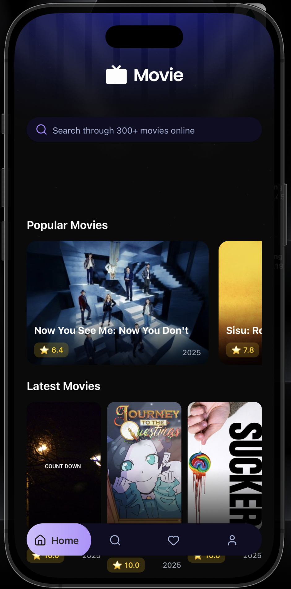
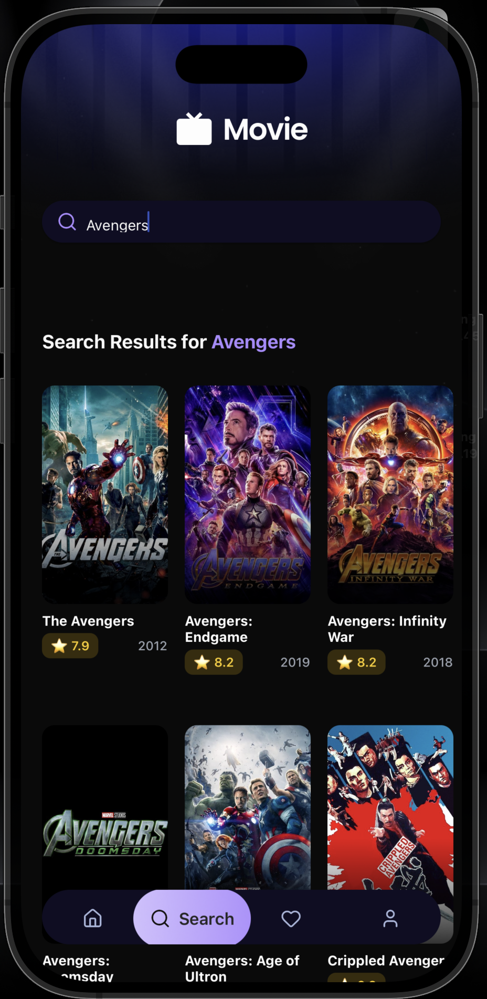
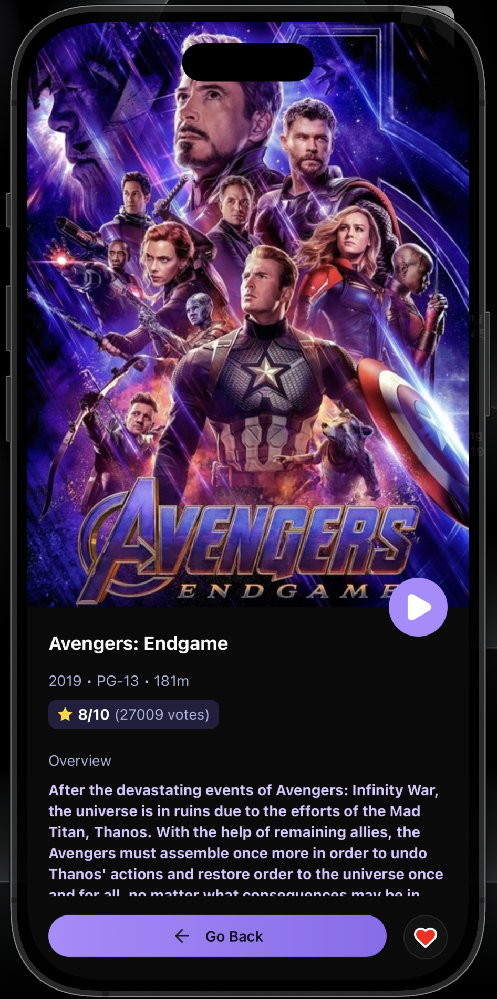
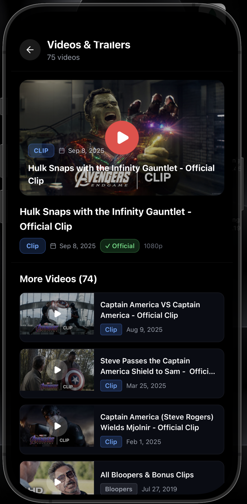
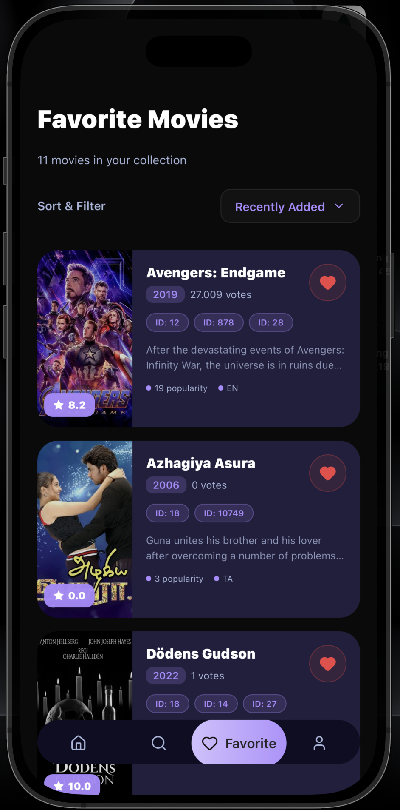
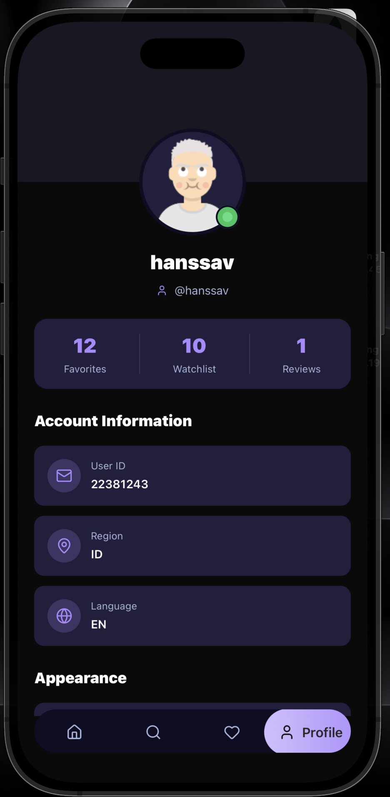

<div align="center">

# 🎬 RN Movie App

### A Premium Feature-Rich Movie Discovery Platform

[](https://expo.dev/)
[](https://reactnative.dev/)
[](https://www.typescriptlang.org/)
[](https://www.nativewind.dev/)
[](https://tanstack.com/query/v5)
[](https://lucide.dev/)

[Features](#-features) • [Tech Stack](#-tech-stack) • [Getting Started](#-getting-started) • [App Interface](#-app-interface)

</div>

---

## 📖 Overview

RN Movie App is a comprehensive movie discovery platform built with React Native and Expo. Designed with a premium aesthetic, it offers a seamless experience for exploring the latest blockbusters, searching through an extensive database (TMDB), and managing personal favorites. Built with the latest native technologies, it ensures high performance, accessibility, and a stunning user interface.

## ✨ Features

### 🎬 Movie Discovery & Exploration

- **Dynamic Hero Carousel** - Explore trending movies with vibrant, high-quality carousels.
- **Categorized Browsing** - Discover movies through Popular, Top Rated, and Latest release logic.
- **Infinite Discovery** - Seamlessly scroll through hundreds of movies with automated pagination.

### 🔍 Advanced Search & Detail

- **Real-time Search** - Instant, debounced search results as you type.
- **Rich Media Integration** - Watch high-definition trailers via YouTube iframe directly in-app.
- **Comprehensive Metadata** - Full access to synopsis, ratings, cast highlights, and release details.

### 👤 User Profile & Personalization

- **Favorites Management** - Save and organize your must-watch movies in a dedicated list.
- **Modern User Hub** - Track your watch stats and manage account information with ease.
- **Appearance Control** - Toggle between premium Dark and Light modes for optimized viewing.

### 🎨 UI/UX Excellence

- **Responsive Layout** - Fully optimized for iOS, Android, and varying screen sizes.
- **Glassmorphic Design** - Modern blur effects, smooth shadows, and premium gradients.
- **Optimistic Interactions** - Instant visual feedback on user actions for a lag-free feel.

## 🛠 Tech Stack

### Mobile Framework

<div align="left">

| Technology                                                                                                    | Description                           | Version  |
| :------------------------------------------------------------------------------------------------------------ | :------------------------------------ | :------- |
|                         | Robust universal React platform       | ^54.0.0  |
|        | Core mobile cross-platform framework  | 0.81.5   |
|       | Statically typed JavaScript           | ~5.9.2   |

</div>

### Styling & UI Components

<div align="left">

| Technology                                                                                                       | Description                         | Version |
| :--------------------------------------------------------------------------------------------------------------- | :---------------------------------- | :------ |
|         | Utility-first CSS for native apps   | ^4.2.1  |
|                      | Professional consistent icon set    | ^0.545.0|
|           | Accessible UI foundation components | Latest  |

</div>

### Data & Performance

<div align="left">

| Technology                                                                                                     | Description                         | Version |
| :------------------------------------------------------------------------------------------------------------- | :---------------------------------- | :------ |
|     | Advanced server state management    | ^5.90.6 |
|                       | Promise-based network client        | ^1.13.1 |

</div>

## 🚀 Getting Started

### Prerequisites

- Node.js 18+ installed
- npm, yarn, or pnpm package manager
- [Expo Go](https://expo.dev/go) installed on your physical device

### Installation

1. **Clone the repository**

   ```bash
   git clone https://github.com/hanssav/rn-movie-app
   cd rn-movie-app
   ```

2. **Install dependencies**

   ```bash
   npm install
   ```

3. **Set up environment variables**

   Create a `.env` file in the root directory:

   ```env
   EXPO_PUBLIC_TMDB_API_KEY=your_api_key_here
   ```

4. **Run the development server**

   ```bash
   npm run dev
   ```

5. **Launch the App**

   Scan the QR code with Expo Go or press `i`/`a` for local simulators.

## 🎨 App Interface

### Home Discovery
<div align="center">
  
</div>

### Search Discovery
<div align="center">
  
</div>

### Movie Detailed View
<div align="center">
  
</div>

### Trailer Playback
<div align="center">
  
</div>

### My Favorites
<div align="center">
  
</div>

### User Profile
<div align="center">
  
</div>

## 🏗 Project Structure

```
app/                       # Expo Router file-based routing
├── (tabs)/                # Primary tab navigation (Home, Search, Profile)
├── movie/                 # Dynamic movie detail routes
└── _layout.tsx            # Global providers & layout configuration
components/                # Application component library
├── icons/                 # Custom optimized SVG components
├── screen/                # Feature-specific screen modules
└── ui/                    # Reusable atomic UI primitives
hooks/                     # Custom data fetching & logic hooks
lib/                       # Utilities, global types, and constants
services/                  # TMDB API service integration
assets/                    # Media assets, fonts, and screenshots
```

## 🤝 Contributing

Contributions are welcome! Please feel free to submit a Pull Request.

## 📝 License

This project is licensed under the MIT License.

## 👨‍💻 Author

**Handi Irawan**

---

<div align="center">
  <p>Built with ❤️ using Expo and NativeWind</p>
  <p>⭐ Star this repo if you find it helpful!</p>
</div>
